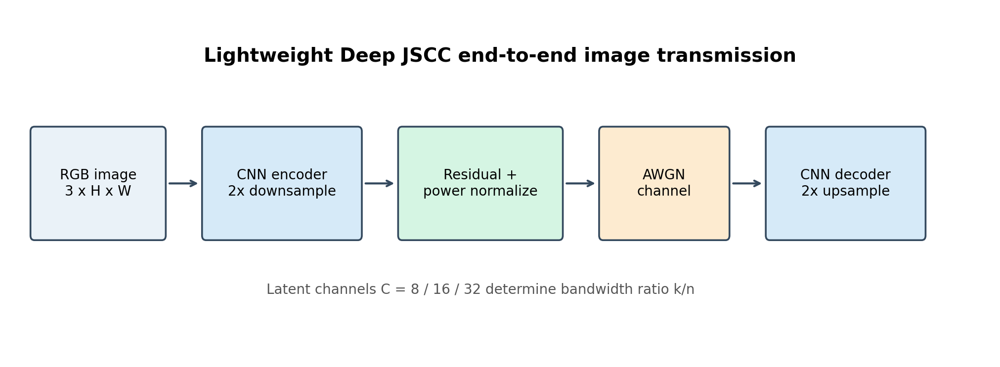
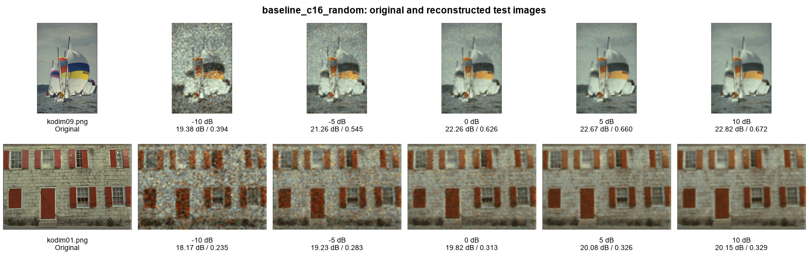
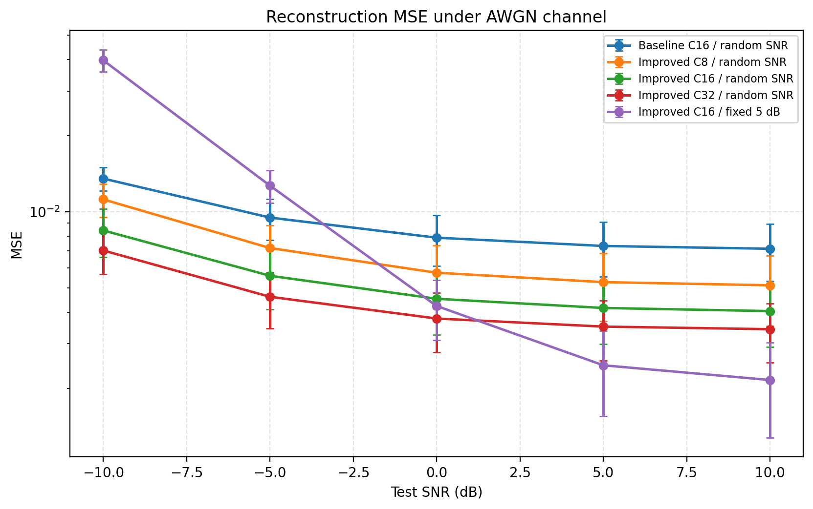
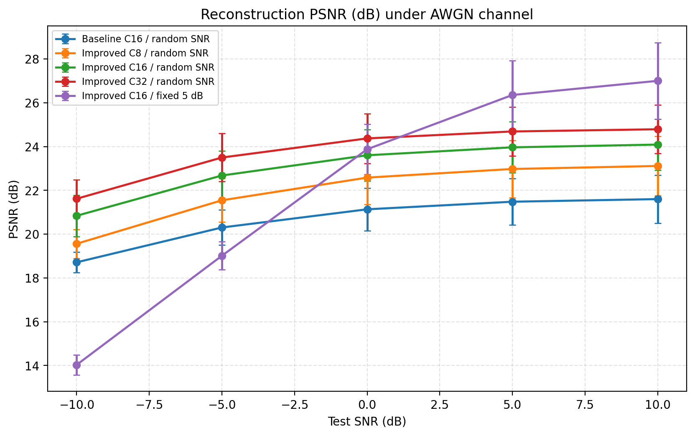
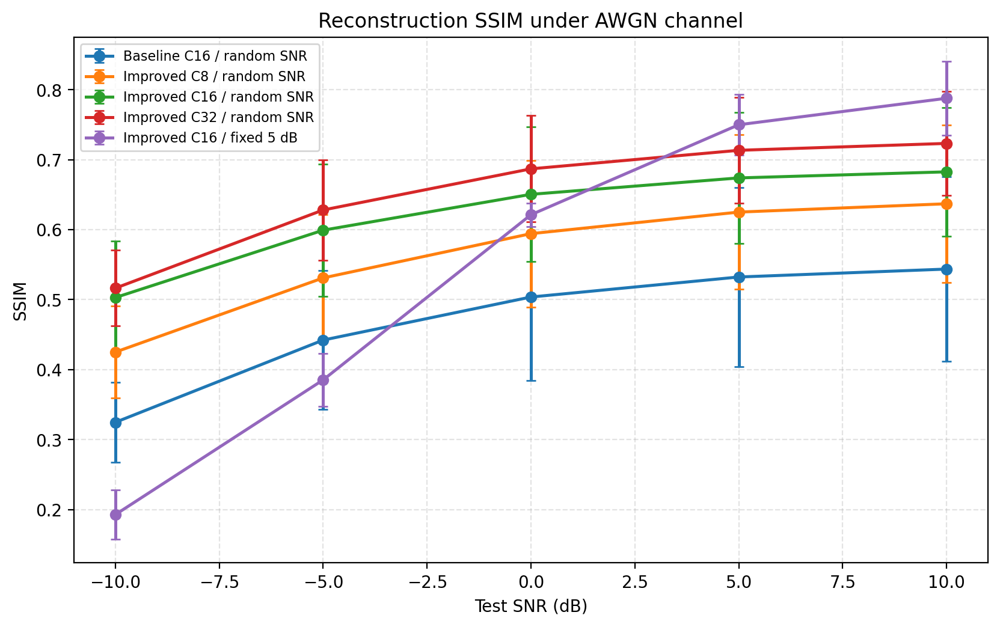
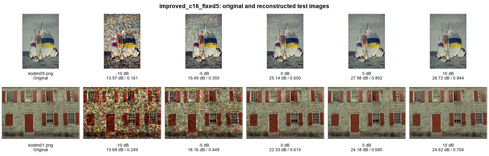
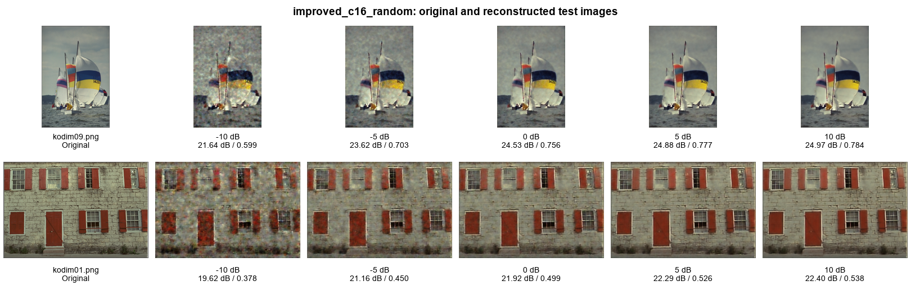
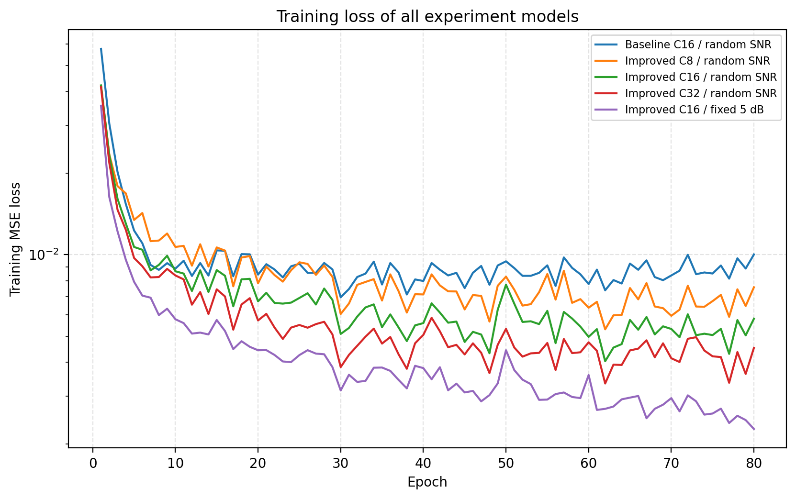

# 基于深度学习的图像语义通信系统设计与实践

课程：现代通信技术实践  
方向：基于深度学习的语义通信系统设计与实践  
小组成员：__________  学号：__________  
指导教师：__________  
完成日期：2026 年 8 月

## 摘要

面向第六代移动通信中的海量感知、边缘智能和低时延机器通信，传统以比特无差错恢复为目标的分离式通信架构，未必能够在有限带宽、有限码长和低信噪比条件下有效保证接收信息的任务价值。语义通信将优化目标由中间比特序列的一致性推进到信息含义、视觉质量或下游任务性能的保持。深度联合信源信道编码（Deep Joint Source-Channel Coding，Deep JSCC）以神经网络联合表示发送端压缩、信道抗噪与接收端重建，为图像语义通信提供了可端到端优化的实现范式。

本课程设计围绕教师提供的“卷积编码器-AWGN 信道-卷积解码器”示例开展理论调研、论文阅读、代码复现、规范化改写和拓展实验。首先，结合 Bourtsoulatze 等人的经典论文，分析 Deep JSCC 的点到点系统模型、平均功率约束、AWGN 与慢 Rayleigh 衰落模型、端到端失真优化方法及其相对 JPEG/JPEG2000 加信道编码方案的潜在优势。其次，逐模块解释 KodakDataset、Encoder、channel_forward、Decoder、训练循环、评价流程以及 MSE、PSNR、SSIM 指标。针对教师代码将全部 24 张 Kodak 图像同时用于训练和测试的问题，本研究按固定种子 42 建立 16/4/4 的训练、验证和测试划分；训练阶段仅从训练图像中确定性随机裁剪 64×64 patch，测试阶段在未见过的完整分辨率图像上统计结果。

拓展部分从模型结构、传输带宽和信道鲁棒性三个角度进行设计。改进网络加入潜变量残差块、PReLU 激活与逐样本发送功率归一化；设置潜变量通道数 C=8、16、32，对应带宽压缩比 k/n=1/12、1/6、1/3；并对比固定 5 dB 训练与从 {-10,-5,0,5,10} dB 均匀采样的随机 SNR 训练。每个模型在 5 个测试 SNR 上对 4 张测试图像分别进行 5 次独立信道采样，每个 SNR 共 20 个统计样本。结果显示，在相同 C=16、相同随机 SNR 策略与相同测试集下，改进模型在 5 dB 的 PSNR 由 21.48 dB 提升至 23.96 dB，SSIM 由 0.5324 提升至 0.6740，MSE 由 0.00732 降至 0.00416，降幅为 43.2%。C=32 在 5 dB 达到 24.69 dB 和 0.7135，表明更高带宽可换取更高重建质量；C=8 虽将带宽减半，仍优于 C=16 规范基线，说明结构改进提高了单位带宽效率。固定 5 dB 模型在匹配条件下达到 26.35 dB，但在 -10 dB 仅为 14.03 dB；随机 SNR 模型在 -10 dB 仍达到 20.84 dB，验证了多信道状态训练对失配鲁棒性的显著作用。实验同时报告参数量、权重体积、训练时间及 CPU/GPU 推理时延，从而完整呈现质量、带宽和复杂度之间的权衡。

关键词：语义通信；Deep JSCC；联合信源信道编码；AWGN；图像重建；信道鲁棒性；端到端学习

## 1 引言

移动通信的服务对象正由人与人之间的消息交换扩展到智能终端、无人系统、工业设备和多模态智能体。传统通信系统将消息抽象为比特序列，并以降低误码率和提高可靠传输速率为核心；然而在视觉感知、远程控制和边缘推理等业务中，接收端最终关心的往往不是每个比特是否一致，而是目标、结构、关系和决策信息是否得到保留。例如，交通摄像头上传图像时，少量背景纹理误差可能不影响车辆识别，而关键交通标志的缺失即使只对应有限像素，也可能导致严重任务错误。因此，面向任务效用的通信目标与面向比特准确率的通信目标并不总是一致。

语义通信以信息含义或任务效用为传输目标，可依据业务选择重建失真、分类准确率、检测精度、文本含义相似度或控制收益等指标。深度学习模型能够从高维数据中提取难以人工定义的非线性结构，并通过端到端训练把语义表示、信道抗扰动和接收任务联合起来。Deep JSCC 进一步取消显式的压缩比特流与硬判决边界，使图像像素直接映射为连续信道输入，在信道质量变化时通常呈现逐渐退化而非突然失效的特征[2]。

本课程设计的目标包括：系统阐释语义通信理论、关键技术、应用和趋势；解释经典 Deep JSCC 论文的贡献、系统模型、实验和指标；运行教师代码并完成 Kodak 多 SNR 重建复现；在严格划分训练集与测试集后完成具有可比实验的结构改进、带宽消融和鲁棒训练。全文按照课程建议的“技术背景-论文原理-系统实现-基础实验-改进设计-改进实验-讨论与展望”逻辑展开。

## 2 语义通信技术背景

### 2.1 传统通信系统与语义通信系统

传统数字通信链路通常依次完成信源编码、信道编码、调制、信道传输、解调、信道译码和信源解码。通信层并不理解图像或文本内容，而以误码率、块错误率、吞吐量和频谱效率为主要指标。这种模块化结构具有接口清晰、可解释、易于标准化和跨业务复用等优点，是现有通信系统的工程基础。

语义通信则把接收端的最终信息质量或任务效用纳入优化。对于图像重建，可优化 MSE、PSNR、SSIM 或感知相似度；对于分类、检测和分割，可直接优化准确率、mAP 和 mIoU；对于文本，可采用 BLEU、ROUGE、BERTScore 或任务完成率。系统允许对任务无关或感知不敏感的信息进行更强压缩，并对关键对象、边缘、实体和关系进行更强保护。因此，语义通信不是简单地“用神经网络替代编解码器”，而是通信目标、表示方式与资源分配原则的联合改变。

“比特准确传输”不等价于“语义准确传输”有两个方向的原因。其一，不同像素或比特具有不同语义重要性；重建图像在像素上存在微小差异，主体类别和空间关系仍可能完全正确。其二，极低误码率也不能弥补信源编码阶段对关键语义的丢弃；如果有限码率被分配给背景纹理而非目标轮廓，接收比特即使全部正确，任务仍可能失败。语义准确性取决于消息、任务和上下文，而不是只由物理层错误计数决定。

### 2.2 Shannon 理论与语义通信的联系和差异

Shannon 信息论把消息的统计不确定性与语义内容分离，建立了熵、互信息和信道容量等基本概念。分离定理表明，在平稳无记忆模型、码长趋于无穷、复杂度和时延不受限制等条件下，只要信源编码率低于信道容量，信源编码与信道编码可分别设计而不损失最优性[1][3]。该结论仍是语义通信不可绕开的理论基础：任何物理传输都受信道容量、功率、带宽和噪声约束。

语义通信关注经典理论通常不显式建模的任务相关性、有限码长、时延和数据结构。短包、快速变化信道和有限算力使分离定理的渐近条件难以充分满足[8]；对于有损图像，系统最终评价的是重建质量而非中间比特流。Deep JSCC 通过直接最小化端到端失真，在给定网络容量和有限维潜变量下学习联合映射。它并未否定 Shannon 理论，而是针对非渐近约束和任务型失真寻找数据驱动的工程解。

### 2.3 核心目标与深度学习的必要性

语义通信的核心目标可归纳为语义保持、任务性能、压缩效率和鲁棒传输。四项目标之间并非总是一致，例如追求极低 MSE 可能增加传输维度，而感知损失可能产生视觉自然但事实不忠实的细节。系统设计需要同时明确任务、信道和风险边界。

语义通信通常需要深度学习参与，是因为自然图像、视频、语音和文本具有高维、非线性和强上下文依赖，人工规则难以穷尽其语义结构。CNN 擅长局部纹理和多尺度特征，Transformer 能够建模长距离依赖，预训练基础模型可提供跨任务语义表征。信道还可作为可微随机层嵌入训练，使损失梯度从接收任务反向传播到发送端。编码器由此学习“传什么”，信道训练决定“如何抗扰动”，解码器学习“如何恢复任务所需信息”。

### 2.4 相对分离式方案的潜在优势与边界

与“JPEG/JPEG2000+信道编码+调制”相比，Deep JSCC 可直接针对最终失真联合优化，在短码长和低时延条件下减少模块间率分配误差，以连续潜变量避免压缩比特流局部错误导致整体失败，并在测试 SNR 变化时获得较平滑的质量退化[2]。但是，数字系统的模块化、互操作性和成熟标准仍难以替代；学习模型可能受到数据分布漂移、信道误差、版本不兼容和不可解释失败影响。因此，Deep JSCC 更适合被视为特定任务和资源约束下的补充，而非对传统数字通信的无条件替代。

### 2.5 6G 与智能应用价值

在 6G 场景中，海量传感器、数字孪生、扩展现实和智能体协作要求通信、感知与计算联合设计。智能物联网终端可上传任务相关特征以降低带宽和能耗；边缘智能可在终端提取浅层特征，在服务器完成推理；车联网和无人机可优先保护行人、车辆和航迹等安全信息；多模态感知可根据信息互补性动态分配图像、语音和文本资源。语义通信由此成为连接物理信道与人工智能任务的一种跨层方法。

## 3 Deep JSCC 论文阅读与原理分析

本章结合参考论文说明深度联合信源信道编码原理，并依次回答评分标准4.1要求的基本思想、端到端联合压缩与抗噪机制、相对传统数字通信的潜在优势，以及论文实验设置、信道模型和评价指标的含义。

### 3.1 论文主要贡献与 Deep JSCC 基本思想

Bourtsoulatze、Kurka 和 Gündüz 于 2019 年提出无线图像 Deep JSCC[2]。论文以两个 CNN 分别参数化编码器和解码器，直接把图像像素映射到复数信道符号；把 AWGN 或慢 Rayleigh 信道建模为无训练参数的随机层，使系统端到端最小化图像失真；在不同带宽比和 SNR 下与 JPEG/JPEG2000 加数字信道编码比较；证明测试信道偏离训练信道时质量呈渐进退化，并在慢衰落中学习到抗噪连续表示。

其关键不在于单独采用自编码器，而在于潜变量同时承担压缩表示与物理信道输入两种角色。无噪声欠完备自编码器只需学习低维图像流形；引入噪声后，相似图像或特征还需映射到信道空间中邻近且可恢复的区域，噪声训练因而同时发挥抗扰编码与正则化作用。

### 3.2 点到点系统模型与功率约束

设输入图像为 x∈R^n，编码器 f_θ 将其映射为 k 个复数信道输入 z∈C^k，k/n 定义为带宽压缩比。发送信号满足 E[z* z]/k≤P，编码器末端输出 z_tilde 按下式归一化：

z = sqrt(kP) z_tilde / sqrt(z_tilde* z_tilde)。

AWGN 信道为 y=z+n，n~CN(0,σ²I)，且 SNR=10log10(P/σ²)。慢 Rayleigh 衰落信道为 y=hz+n，其中 h~CN(0,H_c)，在一幅图像期间保持不变而在图像间独立变化。解码器 g_φ 把 y 映射为重建 x_hat，联合目标为：

(θ*,φ*) = arg min_(θ,φ) E[d(x,x_hat)]。

当 d 取 MSE 时，随机加噪虽无可学习参数，但 y 对 z 的梯度仍可计算，误差可穿过信道层反向传播。若真实信道不可微，则需可微信道代理、代理梯度、强化学习或在线适配。

### 3.3 网络结构与端到端联合优化

论文编码器由五层卷积、PReLU 和功率归一化构成，末层 2k 个实数被组合为 k 个复数 I/Q 符号。信道层施加 AWGN 或慢 Rayleigh 扰动。解码器以镜像式转置卷积逐步上采样，除末层外使用 PReLU，末层 Sigmoid 将像素约束到 [0,1]。全卷积结构允许在 patch 上训练并用于不同分辨率图像。



发送端、信道代理和接收端共同构成计算图。训练样本提供信源统计，随机信道采样提供噪声分布，重建或任务损失提供统一目标。端到端更新不再分别决定压缩率、码率和调制方式，而是在给定潜变量维度和功率约束下直接学习连续映射。

### 3.4 论文实验设置与指标

论文在 CIFAR-10 的 50 000 张训练图和 10 000 张测试图上实验，mini-batch 为 64，每张测试图传输 10 次。高分辨率实验以 ImageNet 约 120 万张图像随机裁剪 128×128 patch 训练，mini-batch 为 32，再在 24 张 768×512 Kodak 图像上测试，每张传输 100 次。Kodak 在原论文中承担独立测试基准，而非训练测试混用。

论文主要评价 PSNR，并以 SSIM 补充结构质量；比较 k/n=1/12 与 1/6 等带宽比。CIFAR-10 实验将 Deep JSCC 与基于 Shannon 容量的 JPEG/JPEG2000 分离式上界比较；Kodak 实验考虑 JPEG/JPEG2000 与多种码率 LDPC、BPSK、4-QAM、16-QAM、64-QAM 的组合。信道覆盖 AWGN 与慢 Rayleigh。容量可达编码是理论参照，有限码长现实系统通常无法完全达到，解释时应区分上界与实际实现。

### 3.5 SNR 影响及相对传统系统的潜在优势

SNR 降低使潜变量偏离期望区域，MSE 增大、PSNR 和 SSIM 降低；SNR 提高后噪声影响减弱，但性能最终受潜变量维度、网络容量和有损目标限制而饱和。分离式方案针对目标 SNR 选择压缩率、信道码率和调制方式，当真实 SNR 低于设计值时块错误率可能快速上升，使压缩比特流无法解码，形成“悬崖效应”；真实 SNR 更高时固定压缩率又限制质量继续改善。Deep JSCC 以连续表示传输，通常表现为噪声和平滑程度逐步变化，优势主要集中在低 SNR、低带宽和信道失配场景。

## 4 系统模型与代码实现

本章按照课程建议的“系统模型与代码实现”顺序说明教师基础代码及本项目的数据划分改写。系统由 Kodak 图像输入、发送端 Encoder、可微信道层 channel_forward 和接收端 Decoder 串联组成；训练阶段以重建 MSE 为目标联合更新收发两端，评价阶段固定模型参数，在多个 SNR 下统计 MSE、PSNR 与 SSIM。以下各节与评分标准 4.3 的七个指定模块以及 4.4 的训练集和测试集改写逐项对应。

### 4.1 KodakDataset 与数据划分改写

教师代码中的 KodakDataset 初始化函数记录图像目录和预处理变换，通过 os.listdir 获取 PNG 文件名；__len__ 返回图像数量；__getitem__ 按索引打开图像、转换为 RGB、执行 Resize((64,64)) 和 ToTensor()，输出 [0,1] 范围的 3×64×64 张量。该实现轻量，但原版将同一批图像用于训练和测试，不能严格评价未见图像上的泛化能力。

本项目继续使用课程材料提供的 Kodak 24 张无损 PNG，默认路径为 ../basic_code/kodak，并完成评分标准 4.4 允许的方案 a：按文件级将 Kodak 固定划分为训练集、验证集和测试集。程序采用随机种子42生成 16/4/4 划分，具体文件名写入 configs/split.json；load_split 在启动时检查集合交集，若发现重复文件则直接报错。训练端新增 KodakPatchDataset，仅从16张训练图中按确定性随机规则裁剪 64×64 patch，并进行随机水平翻转，每个 epoch 生成256个样本；验证端使用4张图选择最低验证 MSE 的 checkpoint；测试端使用另4张从未参与训练或选模的完整图像。由此明确了数据来源、划分方式和实验设置，并避免图像级数据泄漏。

### 4.2 发送端 Encoder

Encoder 依次采用 Conv2d(3,32,3,stride=2)、ReLU、Conv2d(32,64,3,stride=2)、ReLU 和 Conv2d(64,16,3,stride=1)。两次步长为2的卷积把 64×64 图像降采样为 16×16 特征图，末层产生 16×16×16 潜变量，同时完成特征提取和维度压缩。教师代码注释称其为简化 U-Net，但由于没有跨尺度跳跃连接，更准确地说属于浅层卷积自编码器。

### 4.3 AWGN 信道函数 channel_forward

channel_forward 首先计算 signal_power=mean(x²)，把 SNR 从 dB 转为 snr_linear=10^(SNR/10)，再由 noise_power=signal_power/snr_linear 得到噪声功率，生成与潜变量同形状的高斯噪声并返回 x+noise。该加法运算可微，重建误差可以穿过信道层传播至编码器；原函数采用整批平均功率，虽然实现简洁，但不能保证每个样本具有完全相同的发送功率。

### 4.4 接收端 Decoder

Decoder 首先使用 ConvTranspose2d(16,64,3,stride=1) 提炼含噪潜变量，再通过两层 stride=2 的转置卷积把空间尺寸由 16×16 恢复至 64×64，通道数依次变为64、32和3。中间层采用 ReLU，末层使用 Sigmoid 将输出像素约束到 [0,1]，从而得到与输入尺寸一致的重建图像。

### 4.5 训练循环

每个 batch 依次执行数据搬移、optimizer.zero_grad()、随机选择 current_snr、模型前向传播、MSE 计算、loss.backward() 和 optimizer.step()；随后按 epoch 汇总平均损失，最终使用 torch.save 保存权重。随机 SNR 使同一模型在训练期间经历多种噪声强度，形成对信道失配的基本鲁棒性。本项目改写后的训练器还加入验证集选模、固定随机种子、日志记录和断点文件保存。

### 4.6 评价流程与评价指标

evaluate.py 加载 semantic_model.pth，调用 model.eval()，并在 torch.no_grad() 下依次遍历 -10、-5、0、5、10 dB。输出张量由 C×H×W 转为 H×W×C NumPy 数组，对每张图计算指标后求数据集均值。本项目扩展评价器对每张测试图执行多次独立信道采样，同时保存逐样本 CSV、均值与标准差汇总 CSV 以及原图和重建图。

MSE 是所有像素平方误差的均值，数值越小越好，也是本实验的训练损失；像素范围为 [0,1] 时，PSNR=10log10(1/MSE)，数值越大表示像素失真越小；SSIM 从局部亮度、对比度和结构三个方面比较图像，越接近1表示结构越相似[5]。MSE 和 PSNR 强调像素保真，SSIM 补充视觉结构，三者联合报告能够避免单一指标造成片面结论。

## 5 基础实验结果

### 5.1 教师代码运行与复现设置

本研究首先在 basic_code 目录原样运行教师提供的 train.py。KodakDataset 从 ./kodak 读取 24 张 PNG，将图像转换为 RGB 并统一缩放至 64×64；模型采用三层卷积编码器、AWGN 信道和三层转置卷积解码器。训练设置为 batch size=4、epoch=200、Adam 学习率10^-3和 MSE 损失，每个 batch 从 {-10,-5,0,5,10} dB 中随机选取一个 SNR。训练结束后生成 basic_code/semantic_model.pth，再运行 evaluate.py 依次测试课程要求的五档 SNR。该步骤用于确认教师基础流程可以完整运行。

### 5.2 不同 SNR 下的定量结果

教师基础代码的原样复现结果如下表所示。需要说明的是，原脚本使用相同24张图像训练和测试，因此该表用于证明基础流程和指标计算复现成功，不能解释为未见图像上的泛化性能；严格划分后的规范基线及改进模型结果将在第9章比较。

| SNR/dB | MSE | PSNR/dB | SSIM |
|---:|---:|---:|---:|
| -10 | 0.0130 | 19.34 | 0.4517 |
| -5 | 0.0067 | 21.97 | 0.5837 |
| 0 | 0.0049 | 23.43 | 0.6605 |
| 5 | 0.0043 | 24.02 | 0.6946 |
| 10 | 0.0040 | 24.27 | 0.7060 |

从 -10 dB 到 10 dB，噪声相对功率逐渐降低，MSE 由0.0130降至0.0040，PSNR 由19.34 dB升至24.27 dB，SSIM 由0.4517升至0.7060。三项指标具有一致趋势，证明提高信道质量能够降低像素误差并改善结构保真；5 dB 以后增益逐渐减小，则说明系统瓶颈开始由信道噪声转向潜变量压缩和网络容量。

### 5.3 原图与重建图及 SNR 影响

在不改变教师 Encoder 和 Decoder 基本结构的规范基线中，本项目进一步改写评价器，使其保存原图以及 -10、-5、0、5、10 dB 下的重建结果。图2给出两张严格测试图的多 SNR 重建网格，完整结果位于 outputs/reconstructions。



低 SNR 重建中存在明显噪点、颜色扰动和边缘模糊；随着 SNR 提高，主体轮廓、颜色和局部结构逐渐稳定。高 SNR 区间的视觉改善趋缓，与定量指标的饱和趋势一致。该现象表明 Deep JSCC 的连续潜变量能够随信道恶化逐渐降低重建质量，而不会像有限码长数字系统那样必然发生突然完全失效。

## 6 语义通信关键技术分析

### 6.1 语义编码器

CNN 以局部连接和权重共享提取空间结构，是轻量图像 JSCC 的常用选择。ResNet 用恒等捷径缓解优化困难[10]；Transformer 以自注意力建模长距离依赖，但计算和显存随序列长度增长[11]。普通自编码器学习确定性压缩；VAE 引入概率潜空间与 KL 正则[12]；扩散模型具有强生成先验，但推理成本、事实一致性和端侧部署仍是难点[13]。本设计采用轻量 CNN 加残差块，是 CPU 可运行性与效果之间的折中。

### 6.2 信道建模与鲁棒训练

AWGN 是基础加性噪声模型。Rayleigh 适合无直视径多径环境，Rician 在散射分量上叠加直视分量，其 K 因子刻画直视径强弱。真实系统还需考虑频率选择性、时变、干扰、功放非线性、量化和同步误差。训练可采用固定 SNR、多 SNR 随机采样、课程学习、信道条件输入或在线自适应。固定训练可提高匹配性能，多 SNR 训练则提高失配鲁棒性。

### 6.3 损失函数

MSE 强调像素保真和 PSNR，但易平滑；L1 对异常误差更稳健；SSIM 或 MS-SSIM 直接关注结构；LPIPS 用预训练特征度量感知相似性[14]；对抗和扩散损失可提高自然度，却可能生成原图不存在的细节。任务型系统还可使用分类、检测、分割或文本任务损失。混合损失的权重会改变失真、感知和忠实度的平衡。本实验为与教师代码及论文主目标可比，使用 MSE。

### 6.4 评价指标

图像重建至少报告 MSE、PSNR、SSIM。LPIPS 关注感知特征距离；FID 比较真实与生成分布[15]，需要足够样本，不适合仅 4 张测试图。任务型通信应报告准确率、mAP、mIoU，文本可报告 BLEU、ROUGE、BERTScore。还应报告带宽比、潜变量维数、参数量、模型体积、训练时间、推理时延和 CPU/GPU 成本，并说明数据划分、信道采样次数和统计口径。

### 6.5 泛化与复杂度

模型可能同时对图像分布和训练信道过拟合。泛化应覆盖未见图像、训练/测试 SNR 不一致、信道模型不一致和跨数据集迁移。参数量不等于全部运行成本，卷积 FLOPs、内存访问、输入分辨率、线程数和硬件调度都会影响时延。部署还需考虑权重量化、峰值内存、能耗、模型同步与安全更新。

## 7 拓展创新方法设计

### 7.1 公平基线定义

为形成公平的“原始模型-改进模型”对照，本项目保留教师 Encoder、Decoder、ReLU 和 C=16，仅替换为严格 16/4/4 划分、验证选模、完整图测试、固定种子和重复信道采样，记为 Baseline C16 random。它与改进 C16 共享训练 patch、epoch、优化器、SNR 集合和测试噪声种子。因此，后续性能差异主要来自结构与训练策略，而不是数据划分或评价随机性。

### 7.2 研究问题

拓展围绕三问展开：相同带宽下，残差结构与功率约束能否提高质量；改变潜变量 C 后，质量增益是否值得额外带宽和复杂度；固定与随机 SNR 在匹配性能和失配鲁棒性之间有何权衡。对应结构对照、带宽消融和鲁棒性对照均有实际实验。

### 7.3 残差、PReLU 与功率归一化

改进模型在编码器和解码器潜变量空间各加入一个两层 3×3 卷积残差块，并采用 PReLU。F(z)+z 保留恒等信息通路，使网络学习有益增量；PReLU 的负半轴斜率可学习。PowerNormalize 对每个样本计算 p_i=mean(z_i²)，执行 z_i/sqrt(p_i+ε)，使平均实数符号功率约为 1，避免不同图像幅值改变实际信道条件。

### 7.4 潜变量与带宽比

输入包含 3HW 个实数。两次下采样后潜变量为 CHW/16 个实数；两个实数组成一个复数符号，则 k=CHW/32、n=3HW，因此：

k/n = C/96。

C=8、16、32 对应 1/12、1/6、1/3。较小 C 降低带宽和部分参数，但压缩更强；较大 C 可传输更多细节，同时增加资源成本。

### 7.5 固定与随机 SNR

固定模型每个 batch 均使用 5 dB，近似优化该条件风险；随机模型从五档 SNR 均匀采样，近似优化多状态平均风险。固定训练预期匹配时更优但对失配敏感；随机训练牺牲部分峰值以扩大工作范围。两组在相同五档 SNR 测试。

### 7.6 Rayleigh 扩展边界

model.py 已实现 slow_rayleigh_channel：为每幅图生成一个 Rayleigh 幅度增益并叠加高斯噪声，解码器不接收显式 CSI。该接口为后续实验保留，但本报告正式训练、曲线和结论均基于 AWGN，未把未完整训练验证的 Rayleigh 结果写成已完成实验。课程要求至少完成一种新信道或一种新 SNR 策略，本研究以固定 5 dB 对比随机多 SNR 作为已有数据支撑的鲁棒性创新。

## 8 实验设置与复现方法

### 8.1 数据和环境

数据为课程材料中的 Kodak 24 张 PNG。严格实验使用 16 张训练、4 张验证、4 张测试；训练为 64×64 patch，测试为 768×512 或 512×768 完整图。环境为 Windows、Python 3.13.5、PyTorch 2.9.0+cu130、NVIDIA GeForce RTX 5060 Ti 16 GB。模型可用 --device cpu 运行，本次 GPU 仅用于加速。

### 8.2 超参数与统计协议

batch size=16，每个 epoch 256 个 patch，最多 80 epoch，每 5 epoch 验证并保存最低验证 MSE checkpoint。Adam 学习率 10^-3，损失 MSE，种子 42。每个模型在 {-10,-5,0,5,10} dB 测试；每个 SNR 对 4 张图进行 5 次独立采样，共 20 个观测，报告均值与样本标准差。

### 8.3 实验矩阵

| 编号 | 模型 | C | k/n | 训练 SNR | 对照目的 |
|---|---|---:|---:|---|---|
| E0 | 教师原代码 | 16 | 约1/6 | 随机五档 | 示例复现；训练测试同集 |
| E1 | 规范基线 | 16 | 1/6 | 随机五档 | 原始结构公平对照 |
| E2 | 改进模型 | 8 | 1/12 | 随机五档 | 高压缩低带宽 |
| E3 | 改进模型 | 16 | 1/6 | 随机五档 | 同带宽结构改进 |
| E4 | 改进模型 | 32 | 1/3 | 随机五档 | 高带宽质量上限 |
| E5 | 改进模型 | 16 | 1/6 | 固定5 dB | 固定/随机鲁棒性 |

E1/E3 共享 C、数据、样本序列与测试种子；E2/E3/E4 仅改变 C；E3/E5 仅改变训练 SNR。日志、原始 CSV、汇总 CSV、checkpoint、曲线和重建图均保存在 outputs。

## 9 改进实验结果与性能分析

### 9.1 MSE 结果

| 模型 | -10 dB | -5 dB | 0 dB | 5 dB | 10 dB |
|---|---:|---:|---:|---:|---:|
| Baseline C16 random | 0.01352 | 0.00948 | 0.00789 | 0.00732 | 0.00713 |
| Improved C8 random | 0.01119 | 0.00718 | 0.00573 | 0.00526 | 0.00511 |
| Improved C16 random | 0.00843 | 0.00558 | 0.00452 | 0.00416 | 0.00404 |
| Improved C32 random | 0.00702 | 0.00460 | 0.00378 | 0.00351 | 0.00343 |
| Improved C16 fixed 5 | 0.03975 | 0.01268 | 0.00423 | 0.00247 | 0.00216 |



随机模型 MSE 随 SNR 单调下降并逐渐饱和。固定模型在 0 dB 以上迅速占优，但 -10 dB 的 MSE 是随机 C16 的约 4.7 倍，体现强烈失配。

### 9.2 PSNR 结果

| 模型 | -10 dB | -5 dB | 0 dB | 5 dB | 10 dB |
|---|---:|---:|---:|---:|---:|
| Baseline C16 random | 18.71 | 20.30 | 21.13 | 21.48 | 21.60 |
| Improved C8 random | 19.56 | 21.54 | 22.58 | 22.98 | 23.11 |
| Improved C16 random | 20.84 | 22.68 | 23.60 | 23.96 | 24.09 |
| Improved C32 random | 21.62 | 23.50 | 24.37 | 24.69 | 24.79 |
| Improved C16 fixed 5 | 14.03 | 19.01 | 23.88 | 26.35 | 27.00 |



同 C16 随机训练下，改进模型五个 SNR 分别提升 2.13、2.37、2.47、2.48、2.49 dB，说明增益不是单点偶然。高 SNR 饱和表明瓶颈转向潜变量和 MSE 对高频的平滑。

### 9.3 SSIM 结果

| 模型 | -10 dB | -5 dB | 0 dB | 5 dB | 10 dB |
|---|---:|---:|---:|---:|---:|
| Baseline C16 random | 0.3247 | 0.4422 | 0.5038 | 0.5324 | 0.5437 |
| Improved C8 random | 0.4250 | 0.5310 | 0.5943 | 0.6252 | 0.6371 |
| Improved C16 random | 0.5030 | 0.5993 | 0.6505 | 0.6740 | 0.6827 |
| Improved C32 random | 0.5164 | 0.6282 | 0.6870 | 0.7135 | 0.7233 |
| Improved C16 fixed 5 | 0.1927 | 0.3853 | 0.6214 | 0.7500 | 0.7878 |



PSNR 与 SSIM 排序一致，说明改进同时降低像素误差并保留结构。5 dB 时改进 C16 的 PSNR 为 23.96±1.17 dB、SSIM 为 0.6740±0.0936；基线为 21.48±1.06 dB、0.5324±0.1282。MSE 下降 43.2%。标准差包含图像内容与信道随机性，测试图仅 4 张，结果用于趋势验证而非大样本置信推断。

### 9.4 压缩率权衡

C8、C16、C32 在 5 dB 的 PSNR 为 22.98、23.96、24.69 dB，SSIM 为 0.6252、0.6740、0.7135。带宽每次翻倍，增益从 0.99 dB 降至 0.72 dB，存在边际收益递减。Improved C8 带宽仅为 Baseline C16 的一半，却高出 1.50 dB 和 0.0928 SSIM，表明结构和功率约束提高单位带宽效率。由于三个组件同时变化，组合实验不能分离单组件贡献；后续应增加逐项消融。

### 9.5 固定与随机 SNR 鲁棒性

固定模型在 5 dB 达到 26.35 dB，比随机 C16 高 2.39 dB；但在 -10 dB 仅 14.03 dB，随机模型为 20.84 dB，相差 6.81 dB。固定模型 SSIM 从匹配条件的 0.7500 降至 0.1927。随机训练覆盖多种噪声，形成更稳健潜空间，代价是峰值较低。稳定已知信道适合专用模型，快速变化或未知信道更适合多 SNR 模型。



### 9.6 原图与重建图



对照图2的规范基线和图7的改进模型可见：低 SNR 帆船图中，基线出现颗粒和彩色噪声，桅杆与帆面边缘模糊；改进模型仍保持主体轮廓与配色。建筑图中，基线在较高 SNR 仍较平滑，改进模型恢复更多窗框与墙面结构。图6的固定模型在 -10 dB 出现大面积失真，而在 5 dB、10 dB 最锐利，直观展示失配风险。MSE 训练倾向条件均值，若加入 SSIM、LPIPS 或生成损失可能改善纹理，但需防止事实不忠实。

### 9.7 复杂度与运行成本

| 模型 | 参数量 | 权重/KiB | 最佳epoch | 训练/s | CPU推理/ms | GPU推理/ms |
|---|---:|---:|---:|---:|---:|---:|
| Baseline C16 random | 72,243 | 286.9 | 65 | 8.02 | 18.01 | 1.40 |
| Improved C8 random | 65,579 | 264.9 | 70 | 11.50 | 19.68 | 3.36 |
| Improved C16 random | 81,779 | 328.4 | 80 | 10.16 | 22.33 | 2.34 |
| Improved C32 random | 128,003 | 509.0 | 65 | 10.93 | 27.31 | 1.85 |
| Improved C16 fixed 5 | 81,779 | 328.3 | 80 | 9.62 | 21.53 | 2.51 |

推理以 kodim09 的 3×768×512 图像测量，预热 3 次后重复 10 次，CPU 使用 14 线程。CPU 时延随规模总体上升，C32 为 27.31 ms。GPU 数据处于毫秒级，启动、同步和随机数开销占比较高，数值不严格单调。训练时间来自当前 GPU 与小数据集，仅说明本实验成本。



随机 SNR 损失波动源于 batch 信道难度不同；固定 5 dB 更平滑。最佳验证 epoch 为 65-80，保存最佳 checkpoint 比使用末轮权重更规范。

### 9.8 有效性分析

内部有效性方面，公平对照共享数据与种子，但组合改进缺少逐组件消融。外部有效性方面，Kodak 仅 24 张、测试仅 4 张，限制泛化结论；更可靠方案应用 DIV2K 或 ImageNet patch 训练，将 Kodak 仅作公共测试。测量有效性方面，三项指标覆盖像素和结构，却无 LPIPS 或下游任务。构念有效性方面，本实验是面向图像重建质量的语义通信，不能直接等同于分类、检测或文本语义通信。

## 10 应用场景与发展趋势

### 10.1 图像、视频、文本和多模态

视频语义通信可利用帧间运动与长期冗余，传输关键帧、轨迹和场景变化；语音可围绕可懂度、音色或指令正确率；文本可传输语义向量并以 BLEU、BERTScore 或任务正确率评价[7]。多模态系统可利用图像、语音、文本和传感器数据互补性，优先传输最能减少任务不确定性的模态。

### 10.2 面向任务的通信

分类、检测、分割、问答和控制不一定需要重建原始数据，可直接从受噪潜变量输出任务结果。无人机可传检测特征，工业相机可围绕缺陷分类，车联网可保护交通参与者位置与运动。任务型系统可进一步降低带宽，但对任务定义依赖更强，跨任务复用和失败回退更复杂。

### 10.3 大模型与基础模型

视觉基础模型、视觉语言模型和大语言模型可提供通用语义 token、跨模态对齐与生成先验。发送端可传场景描述、对象 token 或检索索引，接收端依据共享知识恢复内容或完成问答。这也引入幻觉、版本不一致、隐私泄露和算力成本，评价必须区分语义合理、任务正确与事实忠实。

### 10.4 MIMO、OFDM、RIS、ISAC 与边缘智能

Deep JSCC 可与 MIMO 波束、OFDM 子载波、RIS 相位和 ISAC 联合优化，并根据信道、任务和算力动态调整 C，实现可伸缩传输。边缘智能允许在终端与服务器切分网络，联合权衡带宽、时延、隐私和能耗。工程落地还需纳入导频、同步、峰均功率比、射频非线性和协议开销。

### 10.5 安全、隐私和生成式通信

潜变量不等于加密，攻击者可能用反演网络恢复身份与场景。可研究差分隐私、特征加密、对抗训练与访问控制。生成式语义通信可用少量条件生成高感知质量内容，但需要可信度标记、不确定性估计和事实一致性约束。标准化还应规定模型版本、能力协商、质量指标、异常检测、传统链路回退和互操作。

## 11 问题讨论与局限性

第一，本项目没有实现论文全部数字基准。教师任务不要求完整复现原论文，本研究完成简化 Deep JSCC、五档 SNR 指标与结构对比，但未实现 JPEG/JPEG2000+LDPC+调制的完整链路；传统对比结论来自论文分析而非本项目直接测量。

第二，正式实验仅覆盖 AWGN。代码有慢 Rayleigh 接口，但缺少专门训练、重复评价和曲线，不能声称已完成新信道实验。后续可比较 AWGN 训练/Rayleigh 测试、Rayleigh 专训与混合信道训练。

第三，带宽比按潜变量维数估算，未计同步、导频、量化、成帧和调制成形开销；功率归一化约束平均功率但不约束峰均功率比。真实部署需完成潜变量到 I/Q 波形标定并研究量化与功放非线性。

第四，随机 patch 增加局部样本，严格划分避免泄漏，但不能替代大规模多场景数据。应扩大测试集并报告置信区间或跨数据集结果。

第五，高 PSNR/SSIM 不一定意味着分类或检测更准确。任务型系统应联合任务损失、重建损失、传输成本与安全约束，并分级评价关键语义错误。

## 12 总结

本课程设计完成语义通信理论调研、Deep JSCC 论文阅读、教师代码复现、数据集规范化和拓展创新。报告覆盖传统与语义通信差异、Shannon 联系、端到端机制、AWGN 模型、SNR 影响、关键技术、复杂度、应用与趋势；逐项解释七个代码模块，并记录教师代码五档指标。

严格实验以 16/4/4 图像划分消除泄漏。组合结构改进在相同 C16 和随机 SNR 下，使 5 dB PSNR 提升 2.48 dB、SSIM 提升 0.1416、MSE 降低 43.2%。潜变量实验揭示带宽收益递减，C8 在一半基线带宽下仍超过基线 C16。固定与随机 SNR 对比表明，专用模型匹配时峰值更高，而随机训练在 -10 dB 高出 6.81 dB。参数量、模型体积、训练和 CPU/GPU 时延同步报告，说明创新由公平对照、定量曲线和视觉结果共同支撑。

## 参考文献

[1] C. E. Shannon. A Mathematical Theory of Communication. Bell System Technical Journal, 1948, 27(3): 379-423; 27(4): 623-656.

[2] E. Bourtsoulatze, D. B. Kurka, D. Gündüz. Deep Joint Source-Channel Coding for Wireless Image Transmission. IEEE Transactions on Cognitive Communications and Networking, 2019, 5(3): 567-579.

[3] T. M. Cover, J. A. Thomas. Elements of Information Theory. 2nd ed. Wiley, 2006.

[4] J. Ballé, V. Laparra, E. P. Simoncelli. End-to-End Optimized Image Compression. International Conference on Learning Representations, 2017.

[5] Z. Wang, A. C. Bovik, H. R. Sheikh, E. P. Simoncelli. Image Quality Assessment: From Error Visibility to Structural Similarity. IEEE Transactions on Image Processing, 2004, 13(4): 600-612.

[6] T. O'Shea, J. Hoydis. An Introduction to Deep Learning for the Physical Layer. IEEE Transactions on Cognitive Communications and Networking, 2017, 3(4): 563-575.

[7] H. Xie, Z. Qin, G. Y. Li, B.-H. Juang. Deep Learning Enabled Semantic Communication Systems. IEEE Transactions on Signal Processing, 2021, 69: 2663-2675.

[8] Y. Polyanskiy, H. V. Poor, S. Verdú. Channel Coding Rate in the Finite Blocklength Regime. IEEE Transactions on Information Theory, 2010, 56(5): 2307-2359.

[9] A. Krizhevsky. Learning Multiple Layers of Features from Tiny Images. University of Toronto Technical Report, 2009.

[10] K. He, X. Zhang, S. Ren, J. Sun. Deep Residual Learning for Image Recognition. IEEE Conference on Computer Vision and Pattern Recognition, 2016: 770-778.

[11] A. Vaswani et al. Attention Is All You Need. Advances in Neural Information Processing Systems, 2017, 30.

[12] D. P. Kingma, M. Welling. Auto-Encoding Variational Bayes. International Conference on Learning Representations, 2014.

[13] J. Ho, A. Jain, P. Abbeel. Denoising Diffusion Probabilistic Models. Advances in Neural Information Processing Systems, 2020, 33: 6840-6851.

[14] R. Zhang, P. Isola, A. A. Efros, E. Shechtman, O. Wang. The Unreasonable Effectiveness of Deep Features as a Perceptual Metric. IEEE Conference on Computer Vision and Pattern Recognition, 2018: 586-595.

[15] M. Heusel et al. GANs Trained by a Two Time-Scale Update Rule Converge to a Local Nash Equilibrium. Advances in Neural Information Processing Systems, 2017, 30.

## 附录 A 代码结构与复现命令

data.py 实现严格划分与训练 patch；model.py 实现基线、改进模型、AWGN 和慢 Rayleigh；train.py 实现训练、验证、最佳 checkpoint 与日志；evaluate.py 实现多 SNR、多次采样、指标与重建图；plot_results.py 绘制曲线；benchmark.py 测量 CPU/GPU 推理；run_all.py 运行五组实验；configs/split.json 固化划分；outputs 保存模型、CSV、曲线和重建图。

```text
cd semcom_project
pip install -r requirements.txt
python -m pytest -q
python run_all.py --force --epochs 80 --samples-per-epoch 256 --repeats 5 --device auto
python benchmark.py
```

无 GPU 时将 --device auto 改为 --device cpu。完整环境、数据路径、单模型命令、参数和结果位置见 README.md。

## 附录 B 课程要求覆盖对照

| 课程要求 | 报告位置或材料 | 完成情况 |
|---|---|---|
| 传统与语义通信、Shannon、目标、6G价值 | 第2章 | 已覆盖 |
| 比特与语义、深度学习必要性、相对优势 | 第2.1-2.4节 | 已回答 |
| Deep JSCC、AWGN、SNR、传统对比 | 第3章 | 已覆盖 |
| 论文贡献、端到端机制、实验、信道和指标 | 第3.1-3.5节 | 已对应评分点 |
| KodakDataset 与训练/验证/测试集改写 | 第4.1节、split.json | 16/4/4 |
| Encoder、channel_forward、Decoder | 第4.2-4.4节 | 已解释 |
| 训练、评价、MSE/PSNR/SSIM | 第4.5-4.6节 | 已解释 |
| 教师代码训练与五档指标 | 第5.1-5.2节 | 已复现 |
| 基础模型原图与重建图、SNR影响 | 第5.3节、图2 | 已提供 |
| 多 SNR 的三项表格和曲线 | 第9.1-9.3节、图3-5 | 已提供 |
| 原图/重建图及原始/改进对比 | 图2、图6、图7 | 已提供 |
| 模型改进、通道数与鲁棒训练 | 第7章、第9章 | 已完成 |
| 参数、训练、CPU/GPU 推理 | 第9.7节 | 已报告 |
| 应用、趋势、安全与隐私 | 第10章 | 已覆盖 |
| 环境、路径、命令与参数 | 第8章、附录A、README | 已提供 |
